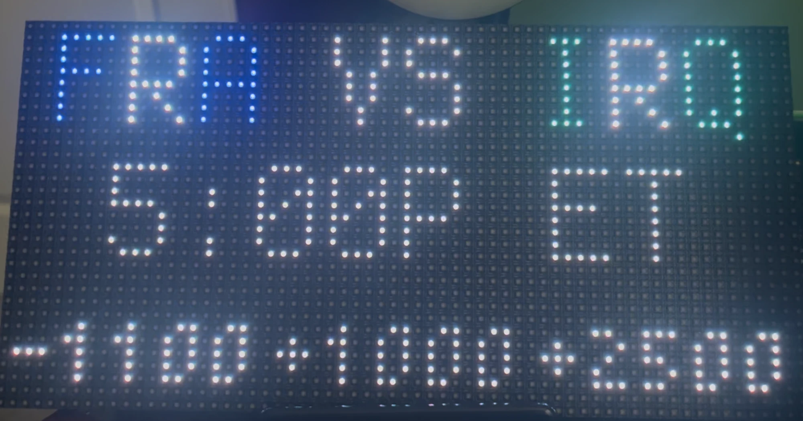
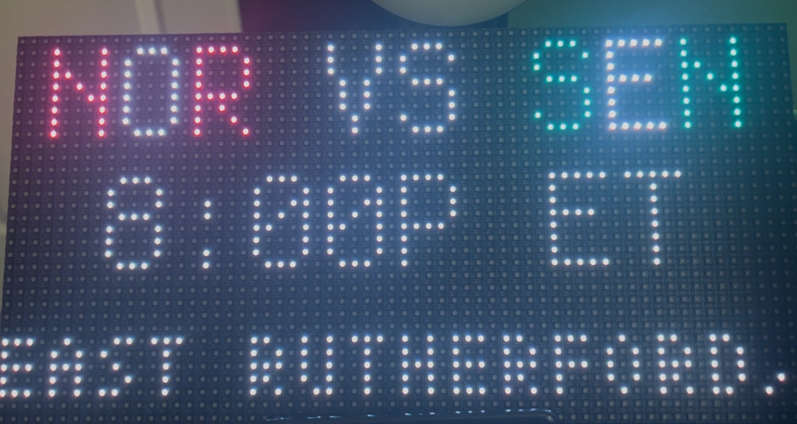

# World Cup Matrix Scoreboard

A CircuitPython scoreboard for the **Adafruit Matrix Portal S3** driving a single **64×32 HUB75 RGB panel**. Fetches live World Cup data from the ESPN API every 2 minutes and cycles through game cards automatically.




---

## Features

### Pre-game cards
- Team abbreviations rendered in each country's official ESPN colors (primary / alternate alternating per letter)
- Kickoff time converted to Eastern Time
- Host city in small font (tom-thumb)
- Flips to an **odds card** showing moneyline lines (Home / Draw / Away) when available

### Live game cards
- Live score and match clock
- Host city

### Final cards
- Final score and FINAL label
- Host city

### Goal alerts
- Full-panel flag BMP for the scoring team
- **GOAL!** flash in gold
- Audio chime via I2S amp (MAX98357A + `sounds/goal.wav`)

### Yellow / Red card alerts
- Full-panel flag BMP for the carded team
- Card type label and player position

### Color safety
- Near-black ESPN team colors (common for some kits) are automatically promoted to white so all abbreviation letters stay visible on the dark matrix

---

## Hardware

| Component | Detail |
|-----------|--------|
| Controller | Adafruit Matrix Portal S3 |
| Panel | 64×32 P4 HUB75 RGB LED matrix |
| Audio amp | MAX98357A I2S — BCLK→A3, LRC→A4, DIN→TX |

---

## Setup

1. Copy all files to the `CIRCUITPY` drive root.
2. Create `settings.toml` with your WiFi credentials:
   ```toml
   CIRCUITPY_WIFI_SSID = "your-ssid"
   CIRCUITPY_WIFI_PASSWORD = "your-password"
   ```
3. Install required CircuitPython libraries into `lib/` (see `lib/` directory).

---

## Configuration

All tunable constants live at the top of `code.py`:

| Constant | Default | Description |
|----------|---------|-------------|
| `TIMEZONE_OFFSET` | `-4` | UTC offset for display times (EDT = -4, EST = -5) |
| `FETCH_SECONDS` | `120` | How often to poll the ESPN API |
| `DISPLAY_SECONDS` | `8` | Time each card is shown |
| `VOLUME` | `0.01` | I2S output volume (0.0–1.0) |

---

## File layout

```
code.py              Main application
settings.toml        WiFi credentials (not committed)
sounds/
  goal.wav           Goal alert chime (16kHz mono 16-bit PCM)
team_logos/
  *.bmp              Flag BMPs for each team (64×32)
worldcup.bmp         Splash screen logo
tom-thumb.bdf        Small bitmap font used for city / odds rows
lib/                 CircuitPython libraries
```
