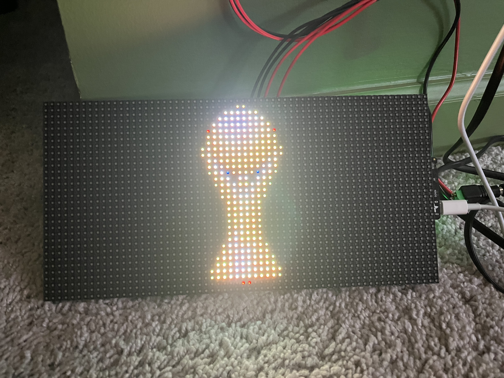
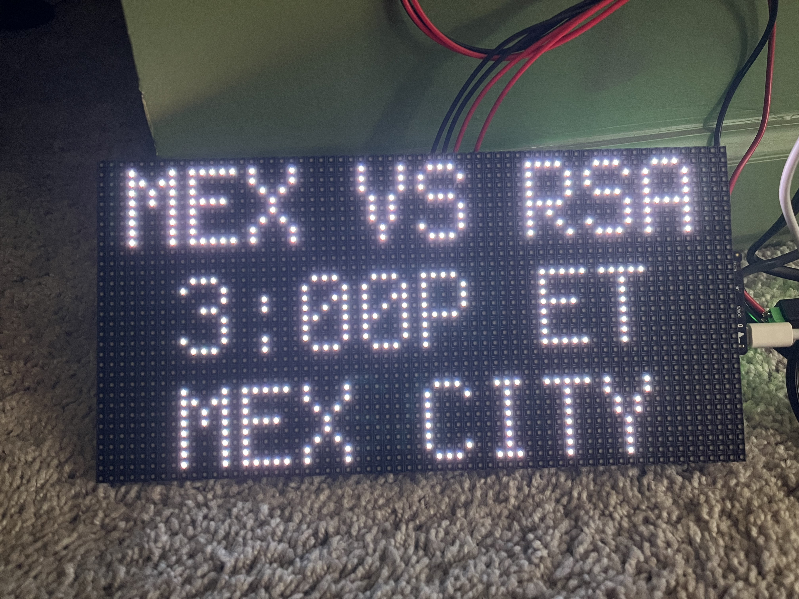

# 🏆 World Cup Matrix Scoreboard

A real-time 2026 FIFA World Cup scoreboard running on an **Adafruit Matrix Portal S3** with a single **64×32 RGB LED matrix**. Fetches live scores, kick-off times, and venue cities from the ESPN API and cycles through all games of the day.

---

## Photos

| Trophy Splash Screen | Game Card Display |
|---|---|
|  |  |

---

## Hardware

| Component | Part |
|---|---|
| Microcontroller | [Adafruit Matrix Portal S3](https://www.adafruit.com/product/5778) |
| Display | 64×32 RGB LED Matrix (HUB75, 4mm pitch recommended) |
| Power | 5V 4A power supply via Matrix Portal barrel jack |

---

## What It Shows

Each game card cycles every **12 seconds** and displays three rows:

```
    MEX    VS    RSA         ← team abbreviations + status
         3:00P ET            ← kick-off time (local) or live clock
          MEX CITY           ← venue city
```

**Game states handled:**
- **Scheduled** — shows kick-off time and city
- **In progress** — shows live score (e.g. `1-0`) and match clock
- **Final** — shows final score and "FINAL"
- **No games today** — shows "NO GAMES / FOUND"

An optional **World Cup logo splash screen** (`worldcup.bmp`) is shown as the first slide.

---

## Repository Structure

```
worldcup-matrix-scoreboard/
├── CIRCUITPY/                  ← copy entire contents to your CIRCUITPY drive
│   ├── code.py                 ← main application
│   ├── worldcup.bmp            ← 32x32 logo splash (optional)
│   ├── settings.toml.example   ← WiFi credential template
│   ├── lib/                    ← CircuitPython libraries (copy as-is)
│   │   ├── adafruit_requests.mpy
│   │   ├── adafruit_datetime.mpy
│   │   ├── adafruit_ticks.mpy
│   │   ├── adafruit_pixelbuf.mpy
│   │   ├── adafruit_connection_manager.mpy
│   │   ├── adafruit_display_text/
│   │   ├── adafruit_imageload/
│   │   └── adafruit_bitmap_font/
│   └── flags/                  ← 20×16 country flag BMPs (not used yet — future feature)
│       ├── USA.bmp
│       ├── MEX.bmp
│       └── ... (48 teams)
└── README.md
```

---

## Setup

### 1. Flash CircuitPython

Download and install **CircuitPython 9.x** for the Matrix Portal S3:
👉 https://circuitpython.org/board/adafruit_matrixportal_s3/

### 2. Copy files to CIRCUITPY

Copy everything inside the `CIRCUITPY/` folder directly to the root of your `CIRCUITPY` drive:

```
CIRCUITPY/
  code.py
  worldcup.bmp
  settings.toml        ← you create this (see step 3)
  lib/
  flags/
```

### 3. Create `settings.toml`

Create a file called `settings.toml` (not `settings.toml.example`) on your CIRCUITPY drive:

```toml
CIRCUITPY_WIFI_SSID = "YourNetworkName"
CIRCUITPY_WIFI_PASSWORD = "YourPassword"
```

> ⚠️ `settings.toml` is in `.gitignore` and will never be committed. Keep your credentials off the drive backup.

### 4. Adjust timezone

In `code.py`, update these two constants near the top to match your timezone:

```python
TIMEZONE_OFFSET = -4   # UTC offset (e.g. -5 for ET, -6 for CT, -7 for MT, -8 for PT)
TIMEZONE_LABEL  = "ET" # Label shown on screen
```

### 5. Power on

The Matrix Portal will:
1. Show `WIFI / CONNECT` while connecting
2. Show `LOADING / SCORES` while fetching
3. Begin cycling through today's games

**NeoPixel status indicator:**
- 🟡 Yellow — connecting to WiFi
- 🔵 Blue — fetching data
- 🟢 Green — running normally
- 🔴 Red — error (check serial console)

---

## Configuration

All tunable constants are at the top of `code.py`:

| Constant | Default | Description |
|---|---|---|
| `TIMEZONE_OFFSET` | `-4` | UTC offset for your timezone |
| `TIMEZONE_LABEL` | `"ET"` | Timezone label shown on screen |
| `FETCH_SECONDS` | `300` | How often to refresh from ESPN API (seconds) |
| `DISPLAY_SECONDS` | `12` | How long each game card is shown (seconds) |
| `display.brightness` | `0.05` | Matrix brightness (0.0–1.0) |

---

## Flag Assets (Future Feature)

The `CIRCUITPY/flags/` directory contains **48 country flag BMPs** at 20×16 pixels in RGB565 format — one per 2026 World Cup team. These are not currently used by `code.py` but are ready for a future enhancement that would display a team's flag alongside their abbreviation.

---

## Data Source

Live scores are fetched from the **ESPN public API**:

```
https://site.api.espn.com/apis/site/v2/sports/soccer/fifa.world/scoreboard
```

No API key required. Data refreshes every 5 minutes by default.

---

## Dependencies

All required libraries are included in `CIRCUITPY/lib/`. They come from the [Adafruit CircuitPython Bundle](https://github.com/adafruit/Adafruit_CircuitPython_Bundle).

| Library | Purpose |
|---|---|
| `adafruit_requests` | HTTP requests over WiFi |
| `adafruit_datetime` | Date/time math for UTC→local conversion |
| `adafruit_ticks` | Millisecond tick timers (no RTC needed) |
| `adafruit_display_text` | Text labels on the matrix |
| `adafruit_imageload` | Loading BMP files |
| `adafruit_bitmap_font` | Font support |
| `adafruit_pixelbuf` | NeoPixel dependency |
| `adafruit_connection_manager` | WiFi connection management |
| `neopixel` | Status LED on the Portal |
